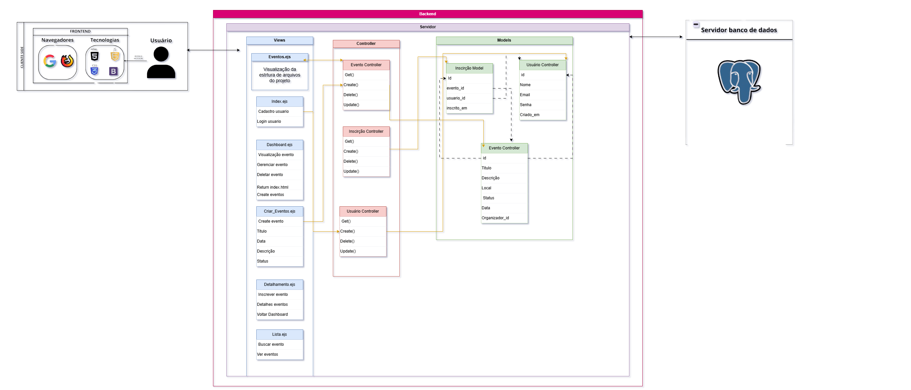

### INTRODUÇÃO
Este projeto consiste em um sistema simples de gerenciamento de eventos, no qual os usuários podem se cadastrar, criar eventos ou até se inscrever em eventos criados por outros. Primeiramente o modelo logico foi criado ultilizando o mermaid.live em forma de SQL ultilizando os três pilares usuários, eventos e inscrições. Após a realização do modelo logico, a ultilização de um MVC pra se conectar ao banco de dados ultilizando postgre com o supbase fara esse projeto mais real.

### MODELO RELACIONAL
Na imagem a seguir pode se encontrar o modelo relacional feito no mermaid.live.
Neste modelo é possivel analisar a funcionalidade do sistema gerenciador de eventos. No qual o usuario com identificação por: Nome, email e senha consegue se inscrever. Na tabela inscrições é necessario uma autenticação desse usuario por meio do usuario_id, e tambem de qual evento se trata evento_id, ou seja um cliente consegue realizar diversas inscrições em diversos eventos. Por fim chegando na tabela eventos é necessario a identificação por: titulo, descrição, local e data do evento e assim a tabela eventos tambem consegue gerenciar seus usuarios como: excluir ou adicionar os mesmos de acrodo com as inscrições assim fechando um loop de um sistema funcional.

Os atributos: cirado_em (tabela usuarios), inscrito_em (tabela inscrições) e organizador_id são informações relavantes dentro do modelo relacional, pois no banco de dados vão ficar guardados e salvos para informações futuras como por exemplo saber quando um usuario foi criado ou inscrito caso tenha uma falha no sistema.
</img>

### MODELO FISICO

CREATE TABLE IF NOT EXISTS eventos (
    id SERIAL PRIMARY KEY,
    nome VARCHAR(100) NOT NULL,
    descricao TEXT,
    data_evento TIMESTAMP,
    local VARCHAR(100),
    status VARCHAR(20) DEFAULT 'agendado',
    created_at TIMESTAMP DEFAULT CURRENT_TIMESTAMP,
    updated_at TIMESTAMP DEFAULT CURRENT_TIMESTAMP
);

### DIAGRAMA MVC
Na imagem a seguir pode-se encontrar o diagrama MVC feito no draw.io

Nossa arquitetura de aplicação web foi construída seguindo o padrão Model-View-Controller (MVC), com o propósito de efetuar uma divisão essencial de responsabilidades entre as camadas, assim facilitando sua manutenção ao longo do projeto. O diagrama exibido  foi separado em três blocos essenciais: Cliente, Servidor e Banco de Dados. Essa separação também permite uma melhor visualização do diagrama, assim como se caracteriza como padrão do MVC.

Já o front-end realiza  e recebe requisições  HTTP com os métodos GET (buscar), POST (criar), PUT (atualizar) e DELETE (apagar) essas requisições chegam diretamente ao controller, que verificam as solicitações e  acionam os services depois repositories até chegaram no models que se conecta com banco de dados. 

| Camada      | Função                                                                                     |
|-------------|--------------------------------------------------------------------------------------------|
| Controller  | Recebe e responde requisições diretamente do cliente.                                      |
| Service     | Responsável pelas regras de negócios.                                                      |
| Repository  | Acessa o banco de dados e realiza buscas específicas (Post/Get), garantindo consultas SQL. |
| Model       | Define o modelo relacional e as tabelas no banco de dados (PostgreSQL).                    |
| View        | Renderiza a página para melhor visualização e interação do cliente.                        |

Tendo em vista essa explicação detalhada das camadas é possível apronfudar sobre o diagrama MVC.

  Arquitetura-MVC 
   
  

## Views:

## Eventos.ejs: 
Visualização - Ver estrutrua de pastas

## Index.ejs
Login - Usuario
Cadastro - Usuario

## Dashboard.ejs:
Visualização - Ver eventos
Sair - Voltar pra tela de login
Criar - Criar um novo evento

## Criar_Eventos.ejs:
Criar - Criar um novo evento

## Detalhamento.ejs:
Detalhes- Outros eventos mundiais e seus eventos

